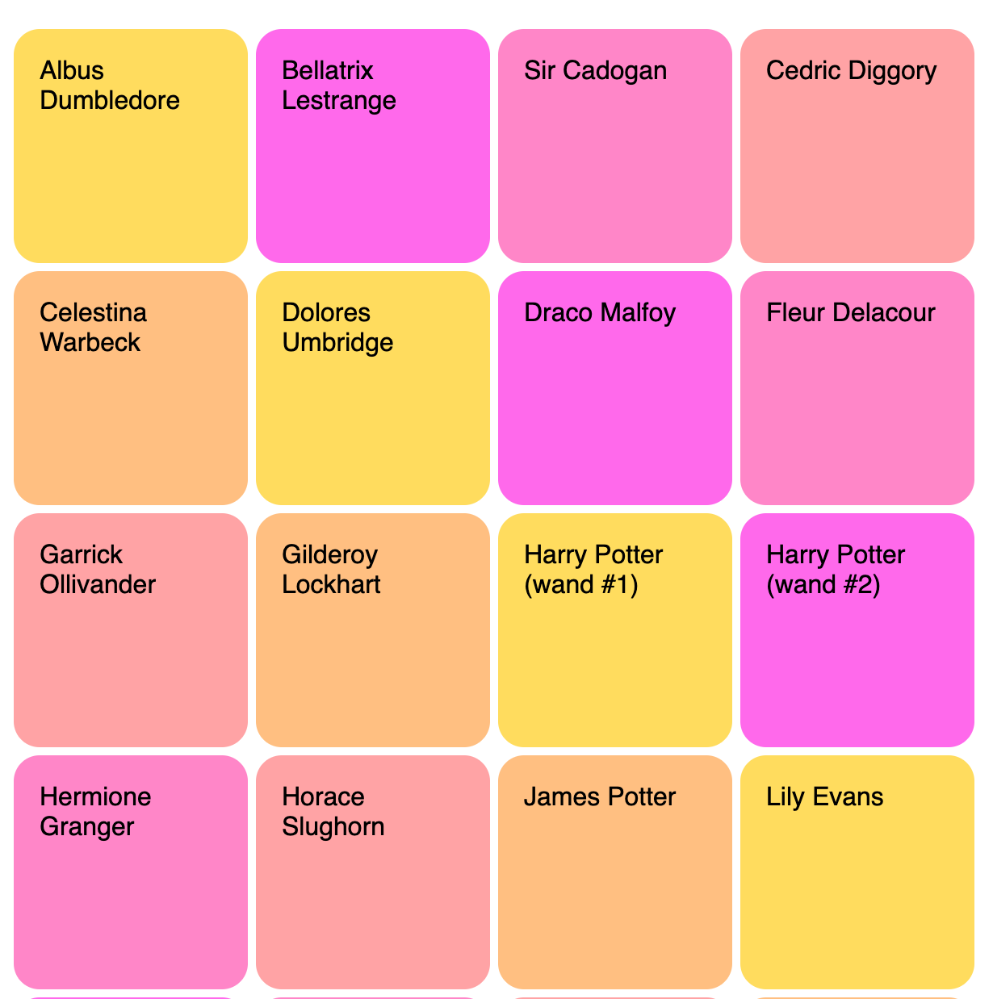

# Ollivander's

Welcome to Zoominfo Engineering Bootcamp exam.

## Description

This repository contains a server and a client applications.
The application is Ollivander's wands archive.
It allows you to search for wand and display some details about them.

### Server

The server implemented using `Express JS` and provide 2 endpoints.

#### Search

This endpoint provides search mechanism for wands. The search URL structure:

```
GET /api/wands/[term[?core&wood&length]]
```

##### Response

The response is always list of wands or an empty list if no wand match the criteria.

```json
[
  {
    "owner": "Albus Dumbledore",
    "wood": "Elder",
    "length": "15\"",
    "core": "Thestral tail hair",
    "flexibility": "Unknown"
  }
]
```

##### Constrains

* `term` parameter:
    * Without `term` & query string, return all wands (no filter).
    * With `term` return all wands if the owner name contain the term (case-insensitive).
* Query string:
    * Without query string or when it equals to `All` - don't filter by this query string.
    * With query string (one or more) - filter the wands with the key and value of the query string.

##### Examples

Return all wands

```
GET /api/wands
```

Return all wands with `al` in the owner name

```
GET /api/wands/al
```

Return all wands with `al` in the owner name and the wand wood is Elder

```
GET /api/wands/al?wood=Elder
```

#### Options

This endpoint return list of options to populate the filters.

```
GET /api/options/<type>
```

##### Constrains

* Type can be `wood`, `core` or `length`.
* Return list of the `type` resource.
* List should be sorted alphabetically.
* Should not have multiple values.

##### Example

```
GET /api/options/wood
```

Response with:

```json
[
  "Acacia",
  "Alder",
  "Apple"
]
```

### Client

The client application implemented using `Angular`.
The application contain 3 components alongside the application component.

* `AppComponent` - The application.
* `FilterComponent` - A form for searching wands.
* `ResultsComponent` - A list of wands.
* `DetailsComponent` - Details about specific wand.

There are 2 main flows:

1. Application loads, the application is calling the options endpoints to populate the filters and call the search
   endpoint with the default search parameters.
2. Any change in the filter updates the search parameters and call the search endpoint.

---

## Tasks

The exam is not testing your `Angular` knowledge. You required to learn some `Angular` in order to understand how to
work with the implemented components.

All the task written for working with terminal (command line).
You can use any client you are familiar with.

* Do not create new files.
* Do not install new libraries.
* Server project: Do not create new functions.
* Client project: Do not create new components.

### Steps

#### Preparations

1. Open a terminal and clone this repository:
   ```shell
   git clone XXX
   ```
2. Navigate to the server directory, install its dependencies, and run the server:
   ```shell
   cd on-site-examp/server
   npm install
   npm start
   ```
   The output `Server is listening to http://0.0.0.0:3000/` indicates the server is running.
3. Navigate to the client directory, install its dependencies, run the development server:
   ```shell
   cd on-site-examp/client
   npm install
   npm start
   ```
   The output `✔ Compiled successfully.` indicates the server is running.
4. Navigate to http://localhost:4200

#### Server

1. Implement the `getData()` function ([database.js](server/src/database.js)).
2. Implement the `getOptions()` missing features ([options.js](server/src/option.js)).
3. Implement the `search()` function ([search.js](server/src/search.js)).
4. Implement the `validate()` middleware function ([validate.js](server/src/validate.js)).
5. Implement the endpoints ([index.js](server/src/index.js)).

#### Client

1. Fix the URL that load the wands and add missing request feature in the [AppComponent](client/src/app/app.component.ts).
2. Add filter by `flexibility` ([FilterComponent](client/src/app/components/filter/filter.component.ts)).
3. Change the search results ([ResultsComponent](client/src/app/components/results/results.component.ts)):
   
   * Height: 145px
   * Width: 145px
   * Colors:
     * #FFDC5E
     * #FF69EB
     * #FF86C8
     * #FFA3A5
     * #FFBF81
4. Make the details component "modal":
   1. It should open on clicking a wand.
   2. It should close on any click.
   3. It should be at the center of the screen.

#### Done
Run in the root directory the following commands:
```shell
npm install
npm run done
```
